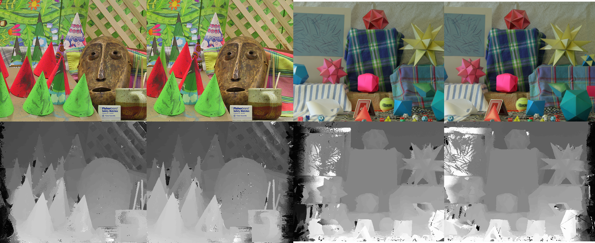
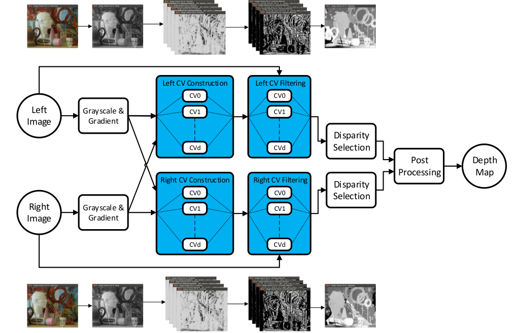

# PRiMEStereoMatch

<p align="center">

</p>

## Theoretical Background

A heterogeneous and fully parallel stereo matching algorithm for depth estimation. Stereo Matching is based on the disparity estimation algorithm, an algorithm designed to calculate 3D depth information about a scene from a pair of 2D images captured by a stereoscopic camera. The algorithm contains the following stages:

* Cost Volume Construction - weighted absolute difference of colours and gradients function.
* Cost Volume Filtering - Adaptive Support Weight (ADSW) Guided Image Filter (GIF) function.  
* Disparity Selection - Winner-Takes-All (WTA) minimum cost selection.  
* Post Processing - left-right occlusion check, invalid pixel replacement and weight-median filtering.  

<p align="center">

</p>

## Implementation Details

* All stages of the algorithm have been developed in both C++ and OpenCL.  
	* C++ parallelism is introduced via the POSIX threads (pthreads) library. Disparity level parallelism is supported, enabling up to 64 concurrent threads.  
	* OpenCL parallelism is inherent through the concurrent execution of kernels on an OpenCL-compatible device. The optimum level of parallelism will be bounded by the platform & devices.  
* Support for live video disparity estimation using the OpenCV VideoCapture interface as well as static image computation.
* Embedded support for experimentation with the OpenCV standard Semi-Global Block Matching (SGBM) algorithm.

## Installation

### Prerequisites
* Hardware:
	* Development Platform - including OpenCL compatible devices
* Software Libraries:
	* OpenCV 2.4 or later - [Installation in Linux instructions](http://docs.opencv.org/2.4/doc/tutorials/introduction/linux_install/linux_install.html)
	* pthread library (lpthread) for non-OpenCL execution on the CPU
	* OpenCL Library (lOpenCL) for execution on the GPU

### Compilation 
* Clone repo to the platform: `git clone https://github.com/PRiME-project/PRiMEStereoMatch.git`
* Enter the base directory: `cd DE_APP`.
* Create and enter build directory: `mkdir build && cd build`
* Invoke cmake to build the makefile: `cmake ..` (Two dots are required in order to reference the base dir)
* Compile the project with the generated makefile: `make -jN`. 
	* Set N to the number of simultaneous threads supported on your compilation platform, e.g. 8.

### Deployment
* Run the application fromt eh build dir: `./DE_APP <program arguments>`
* The following program arguments must be specified:
	* Matching Algorithm type: 
		* STEREO_GIF - Guided Image Filter
		* STEREO_SGBM - Semi Global Block Matching
	* Media type:
		* VIDEO
		* IMAGE <left image filename> <right image filename>
* [optional] When specifying the VIDEO media type, the following arguments can be included:
	* RECALIBRATE - recalculate the intrinsic and extrinsic parameters of the stereo camera. Previously captured chessboard images must be supplied if the RECAPTURE flag is not also set.
	* RECAPTURE - record chessboard image pairs in preparation for calibration. A chessboard image must be presented in front of the stereo camera and in full view of both cameras. Press the R key to capture a frame. The last frame captured is shown beneath the video stream.
	
* For example, to run with the guided image filter algorithm using a stereo camera, specify:
	* `./bin/Release/DE_APP STEREO_GIF VIDEO`
* To run with calibration and capture beforehand, specify:
	* `./bin/Release/DE_APP STEREO_GIF VIDEO RECALIBRATE RECAPTURE`
* Image disparity estimation is achieved using for example:
	* `./bin/Release/DE_APP STEREO_GIF IMAGE left_img.png right_img.png`

* The first time the application is deployed using a stereo camera, the RECALIBRATE and RECAPTURE flags must be set in order to capture chessboard image to calculate the intrinsic and extrinsic parameters.
* This process only needs to be repeated if the relative orientations of the left and right cameras are changed or a different resolution is specified.
* Once the intrinsic and extrinsic parameters have been calucalted and saved to .yml files, the application can be re-run with the same camera without needing to recalibrate as teh parameters will be loaded from these files. The files can be found in the data directory.

### Interactivity

* Press h to display a help menu on the command line. This shows input and control options for the program which change the way the algorithm behaves for the next frame.
* Control Options:
	* Numbers 1 - 8: change the number of threads created by the process
	* m: switch the computational mode between OpenCl and pthreads
	* t: switch the data type use for processing between 32-bit and 8-bit
* Control options are only available for the STEREO_GIF matching algorithm.

## Additional Resources
* [Configuring OpenCL on the ODROID-XU3](http://granolamatt.com/working/2015/02/configure-opencl-on-odroid-xu3/)

## Directory Structure

```
DE_APP		- Project top level directory

folders:
	assets			- OpenCL kernel files
	bin				- binary executable files
	common			- OpenCL common utility/helper functions (C) ARM Ltd
	data			- program data including input images, stereo camera parameters, calibration images, etc
	include			- Project header files (h/hpp)
	src				- Project source files (c/cpp)
	
files:
	cbp2make.linux-x86_64 	- codeblocks project to makefile tool (for x86_64 PC - see (https://sourceforge.net/projects/cbp2make/) for sourceforge project)
	cbp2make_usage.txt		- cbp2make tool manual
	DE_APP.cbp				- Code::Blocks project file
	DE_APP.depend			- Code::Blocks settings file
	DE_APP.layout			- Code::Blocks settings file
	main.cpp				- main C++ file
	Makefile				- project Makefile
```

## References

### Code

 [CrossScaleStereo](https://github.com/rookiepig/CrossScaleStereo) - The basis for some C++ DE functions (GNU Public License)

### Literature

<a name="Hosni2011CVPR">[Hosni2011CVPR]</a>: C. Rhemann, A. Hosni, M. Bleyer, C. Rother, and M. Gelautz. Fast cost-volume filtering for visual correspondence and beyond. In CVPR, 2011

<a name="Hosni2011ICME">[Hosni2011ICME]</a>: A. Hosni, M. Bleyer, C. Rhemann, M. Gelautz and C. Rother, Real-time local stereo matching using guided image filtering, in Multimedia and Expo (ICME), 2011 IEEE International Conference on, Barcelona, 2011. 

<a name="Ttofis2014">[Ttofis2014]</a>: C. Ttofis and T. Theocharides, High-quality real-time hardware stereo matching based on guided image filtering, in Design, Automation and Test in Europe Conference and Exhibition (DATE), Dresden, 2014. 

<a name="He2012">[He2012]</a>: K. He, J. Sun and X. Tang, Guided Image Filtering, Pattern Analysis and Machine Intelligence, IEEE Transactions on, pp. 1397-1409, 02 October 2012. 

### License

This software is released under the BSD 3 Clause License. See LICENSE.txt for details.
